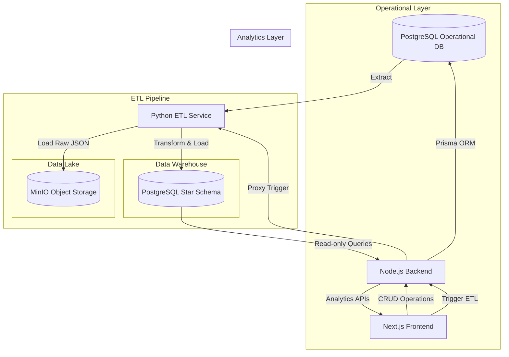

# Architecture

The **SALES//DATA** application follows a modern Full-Stack Data Lake & Data Warehouse architecture leveraging Docker for orchestration. The goal of this architecture is to separate operational data workloads from analytical and reporting workloads.

## End-to-End Flow

### Components

#### 1. React Frontend (Next.js)
A custom, monochromatic UI adhering to the `SALES//DATA` design language. It is strictly separated into Operational sections (Customers, Products, Orders) and Analytics sections (Overview Dashboard, Analytics Dashboard, Data Pipeline).

#### 2. Node.js Backend & API
The API layer handles operational operations using the Prisma ORM to interact with the operational database. For analytics, it bypasses Prisma and sends native SQL queries directly to the Data Warehouse Star Schema. It also proxies pipeline trigger requests to the ETL service.

#### 3. PostgreSQL Operational Database
A normalized relational database (`Customer`, `Product`, `Order` tables) designed for fast ACID transactions. Analytics are deliberately avoided on this database to prevent locking and performance degradation during heavy operational use.

#### 4. Python ETL Service (Dedicated)
A standalone Flask application running Python 3.11. It exposes endpoints to trigger the ETL pipeline and fetch its status. When triggered:
- **Extract**: It reads data from the Operational Database.
- **Load (Data Lake)**: It saves the raw extracted records directly to MinIO as immutable, timestamped JSON files (`raw/customers/`, `raw/products/`, `raw/orders/`).
- **Transform**: It constructs the target Data Warehouse Star Schema.
- **Load (Data Warehouse)**: It merges the fact tables against the dimension keys and loads the transformed data securely into the Data Warehouse.

#### 5. MinIO Data Lake
An S3-compatible object storage solution designed to house the immutable, raw extracted data, acting as the single source of truth in the event that the Data Warehouse needs to be rebuilt.

#### 6. PostgreSQL Data Warehouse
Residing within the same PostgreSQL instance (for simplicity), this represents the analytical Star Schema.
- **`dim_customer`**: Dimension table for customers.
- **`dim_product`**: Dimension table for products.
- **`fact_sales`**: Central fact table storing immutable sales transactions mapped to dimension keys.
